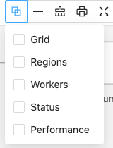
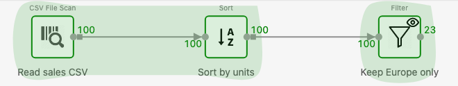

<!--
  ~ Licensed to the Apache Software Foundation (ASF) under one
  ~ or more contributor license agreements.  See the NOTICE file
  ~ distributed with this work for additional information
  ~ regarding copyright ownership.  The ASF licenses this file
  ~ to you under the Apache License, Version 2.0 (the
  ~ "License"); you may not use this file except in compliance
  ~ with the License.  You may obtain a copy of the License at
  ~
  ~   http://www.apache.org/licenses/LICENSE-2.0
  ~
  ~ Unless required by applicable law or agreed to in writing,
  ~ software distributed under the License is distributed on an
  ~ "AS IS" BASIS, WITHOUT WARRANTIES OR CONDITIONS OF ANY
  ~ KIND, either express or implied.  See the License for the
  ~ specific language governing permissions and limitations
  ~ under the License.
-->

---
title: "How Texera Runs Your Workflow"
weight: 10
---

This page explains why some operators start early, some wait, and some finish first. You don't need it to use Texera, but it helps when a run looks "stuck".

## Data flows like an assembly line

Texera doesn't wait for one operator to finish before starting the next. Rows flow down the arrows in small batches, so a Filter can work on the first rows while the CSV reader is still reading the rest. This is called **pipelining**.

## Some operators must see everything first

Some operators can't output anything until they have seen **all** their input. You can't sort a list you haven't finished reading. These are **blocking** operators:

- **Sort**, **Aggregate**, **Distinct**
- Set operators: **Intersect**, **Difference**, **Symmetric Difference**
- **Join**: it reads one input fully first (the *build* side) and then streams the other
- Machine learning **training** operators

While a blocking operator reads, the operators after it show 0 rows. That's normal. Python UDFs written with `UDFTableOperator` behave the same way: they output only after an input is complete.

## Regions

Texera splits a workflow into **regions** at blocking points. Operators in one region run together; a region starts after the regions it depends on finish. Between regions, results are saved (**materialized**) so the next region can read them.

To see regions, click the **Layers** button in the editor toolbar and check **Regions**. On a narrow window the button can be hidden; widen the window if you don't see it.

After you click **Run**, each region is drawn as a shaded area. Here Sort splits the workflow into two regions:

| Shade | Region is… |
|---|---|
| Gray | Waiting |
| Blue or yellow | Running (blue: reading an input that others wait for) |
| Green | Finished |

## Workers

An operator can run as several copies (**workers**) in parallel, each handling part of the data. For Python and other UDFs, set **Worker count** in the property panel. To show the count on each box, check **Workers** in the **Layers** menu.

## Execution mode

The **Settings** tab in the editor's left panel has **Execution Mode**:

- **Pipelined** (default): rows flow between operators as described above.
- **Materialized**: every operator finishes and saves its output before the next one starts. Usually slower, because operators don't overlap.
