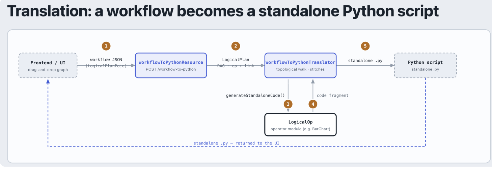
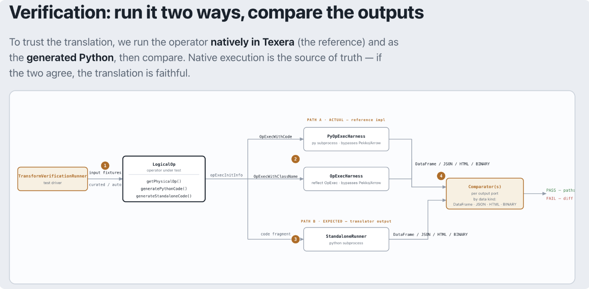

<!--
  ~ Licensed to the Apache Software Foundation (ASF) under one
  ~ or more contributor license agreements.  See the NOTICE file
  ~ distributed with this work for additional information
  ~ regarding copyright ownership.  The ASF licenses this file
  ~ to you under the Apache License, Version 2.0 (the
  ~ "License"); you may not use this file except in compliance
  ~ with the License.  You may obtain a copy of the License at
  ~
  ~   http://www.apache.org/licenses/LICENSE-2.0
  ~
  ~ Unless required by applicable law or agreed to in writing,
  ~ software distributed under the License is distributed on an
  ~ "AS IS" BASIS, WITHOUT WARRANTIES OR CONDITIONS OF ANY
  ~ KIND, either express or implied.  See the License for the
  ~ specific language governing permissions and limitations
  ~ under the License.
-->

---
title: "Guide to Add a New Operator"
weight: 60
---

Writing the operator itself is covered by the
[Java/Scala](/docs/contribution-guidelines/guide-to-implement-java-operator/) and
[native Python](/docs/contribution-guidelines/guide-to-implement-python-operator/) guides.
This page lists what else a new operator needs. It is done when all five hold.

| # | Deliverable | Where |
| --- | --- | --- |
| 1 | Descriptor, executor, registration, icon | `common/workflow-operator/.../operator/<pkg>/` |
| 2 | A stated constraint on every config property | annotations on the descriptor's fields |
| 3 | `generateStandaloneCode()`, or its `inputSchemas` overload | the descriptor, via `StandaloneCodeGenerator` |
| 4 | A green verification run | `OperatorBehaviorSpec` |
| 5 | Unit spec, formatted and linted | the operator's own `*OpDescSpec` |

## 1. Descriptor, executor, registration

- Write the `OpDesc` and the `OpExec`.
- Declare the columns each output port carries: `getOutputSchemas` on a Python operator, a
  `SchemaPropagationFunc` inside `getPhysicalOp` on a Java or Scala one. A schema that
  disagrees with what the executor emits fails at run time, not at compile time.
- Register the descriptor in `LogicalOp`'s `@JsonSubTypes` under a unique name. This is the
  only registration there is: the form, the translator and the verification harness all read
  that list.
- Add `frontend/src/assets/operator_images/<That Same Name>.png`.

## 2. Configuration rules

Every `@JsonProperty` becomes a field in the operator's form, labelled by `@JsonSchemaTitle`
and explained by `@JsonPropertyDescription`. State the operator's real constraints beside it.

### Columns

| Annotation | Meaning |
| --- | --- |
| `@AutofillAttributeName` | one column name from input port 0 |
| `@AutofillAttributeNameList` | a list of column names from input port 0 |
| `@AutofillAttributeNameOnPort1` | one column name from input port 1 |
| `@SampleColumn("iso_country")` | test-only: which fixture column should fill this field |

- Column types go in a class-level `@JsonSchemaInject` carrying `attributeTypeRules`, keyed by
  field name.
- A type rule warns, it does not filter. The dropdown still lists every column.
- Give a rule to columns the operator computes on. Leave labels, grouping keys, facets and
  hover names unconstrained: that a string column did not crash is not a reason to add one.

### Numbers

- Bounds go on the field, as a `@JsonSchemaInject` carrying `minimum` and `maximum`. A lower
  bound may come from `@DecimalMin` instead; an upper bound is read from the schema alone.
- An optional numeric field also needs `@JsonDeserialize(contentAs = ...)` naming its boxed
  class, or a blank reads as 0.

### Free-form strings

- Always give a default value, and an `examples` entry holding one realistic value. The form
  does not render `examples`, but the verification generator fills the field with it.
- Add a `pattern` only where the consumer really constrains the input, and copy the rule from
  that consumer's source instead of writing one from memory.
- Keep the pattern anchored and loose: rejecting a value the operator would have accepted is
  a bug. Two engines read it, the browser's and the verification generator's, and the second
  matches whole strings, so an unanchored pattern does not mean the same thing to both.

### Conditional fields

- `HideAnnotation` hides a field behind another field's value.
- To constrain what a field may hold given what a sibling holds, use Texera's `valueRules`
  key, not a JSON-Schema `allOf`: the form builder merges an `allOf`'s branches into one
  field, leaving a single control carrying every branch's constraints at once. The
  verification generator reads `valueRules` too, and fills the field from the branch that
  applies.

## 3. Standalone Python code (required)

Texera exports a workflow as one runnable script, and each operator contributes its own
fragment. Without one, the export emits a `# TODO:` comment in its place.

- Mix in `StandaloneCodeGenerator` and implement `generateStandaloneCode()`.
- Read `in1df`, `in2df`, … and write `out1df`, `out2df`, …, one per declared port.
- Never write to an input frame. The translator names a variable per output port, so two
  operators reading one upstream are handed the same name, and `inplace=True` or
  `in1df = in1df.dropna()` changes what the other branch goes on to read.
- pandas is imported for every script. Anything else is named by `standaloneImports()`, so a
  script that draws nothing does not need a plotting library to start; a chart gets the
  plotly imports by mixing in `PlotlyStandaloneCode`.
- Override `producesDataFrame()` to false for a visualization whose output is HTML.
- Put definitions the fragment refers to in `standaloneHelpers()`. They are deduplicated
  across the plan.
- Pass every user value through `pyStringLiteral`, or `pyb` with an `EncodableString`. Spliced
  in directly, a column named `a"b` closes the literal early and breaks the whole script.
- A `pyb` field has to reach the template whole. Joining it to anything in Scala first —
  `s"${attribute}_bin"` — hands `pyb` a plain string and the protection is gone, so derive
  such a name in the Python instead. `PythonCodeRawInvalidTextSpec` reports the leak.
- Rendering a column as TEXT takes the declared type, not the value's. A file carries no
  types, so a hole makes pandas read an integer column as a float and a boolean one as 1.0
  and 0.0, and 6 renders as "6.0" where the engine wrote "6". Override the
  `generateStandaloneCode(inputSchemas)` overload and pass the column through
  `renderedAsText`; `None` there means read it as it arrives.
- A TIMESTAMP is a wall clock and carries no zone, so a count from the epoch is read with
  UTC arithmetic on both sides. `new Timestamp(millis)` instead reads it in whatever zone the
  machine is set to, and pandas reads the same number as UTC, so the two paths part by the
  local offset and agree again on a machine set to UTC. `ArrowUtils` states the convention;
  follow it wherever an operator turns a number into a moment.
- Where the two engines genuinely differ, note the difference in a comment.

## 4. Verification

Every operator runs twice on the same input and config: natively in Texera, which is the
reference, and as the generated script. The outputs are compared per port, by data kind
(DataFrame, JSON, HTML, BINARY).

- Nothing is added to the spec for a new operator. It reflects over `@JsonSubTypes` and keeps
  whatever implements `StandaloneCodeGenerator`.
- The run proves the two paths agree, not that either is correct.
- Two assertions read the generated code instead of running it, for what no single run can
  ask: a write to an input frame, and every column knob hostile at once.

### The input

- One checked-in table, `src/test/resources/verify/canonical_fixture.json`, 15 rows.
- The sklearn and text tables are projections of it, not separate files. Source operators
  bring their own file, one per format.
- Eight of its columns are named `a"b\c_…`, one of them carrying a single quote and a newline
  besides, so a run puts the escaping rule above to an operator that took one.
- `CanonicalFixtureSpec` asserts the table's invariants, so an edit that breaks one fails the
  build.

### How the config is generated

`ConfigGenerator` builds a valid config from the annotations alone. Write a curated handler in
`CuratedHandlers` only when a shared table cannot supply what the operator needs, such as
duplicate rows or a cross-field type pairing.

| Field kind | Fill |
| --- | --- |
| One column | `@SampleColumn` if present, else the first unused column of a fitting type |
| Multiple columns | every column of a fitting type, minus the ones a single-column field took |
| An optional column field | the same, but in the `optionals` run |
| Enum / Boolean | swept: one run per value, one knob at a time, with optionals unfilled |
| Number with a `defaultValue` | that value, whatever its bounds |
| Number, bounded | midpoint of min and max |
| Number, min only | `max(min * 2, rows / 2)` |
| Number, unbounded | `rows / 2` |
| Sibling numbers | the same value, then +1, +2… so a start/end pair comes out ordered |
| String | its `defaultValue`, else `examples[0]`, else `"1"` |
| Every free-text knob | also `a"b`, in one hostile run, where the field's pattern admits it |
| Every column knob | also a hostile-named column, in a second hostile run, one knob per type per port |
| Sibling strings | numbered, so they cannot collide: `a"b`, `a"b2`, `a"b3`… and `1`, `2`, `3`… |

A knob takes a hostile column only where one carries the type it already reads, so a chart's
`color` and `pattern` keep ordinary names once its axes have taken them.

### Row order, models, and the tables an operator is handed

- `LogicalOp.orderSensitive` is false by default, so rows compare as a set. Override it to
  true only if the operator establishes an order; today only Sort, Stable Merge Sort and Sort
  Partitions do.
- A model in a binary column is compared by behavior: both sides are unpickled and their
  `predict` output on the training features is compared.
- Both paths seed numpy's global RNG identically, so sklearn fits draw the same numbers.
- Every operator also gets an empty-cell run, on the same table with one cell emptied per
  column, and an empty-table run, on the same columns with no rows under them. The two ask
  different questions: the first table still has a value in every column somewhere, so code
  that reads a column's range or its quantiles still finds one, while the second has nothing
  to read and an operator that assumed otherwise raises instead of passing the emptiness
  through. An upstream filter that matches nothing hands an operator exactly that.
- Withhold either only through `variantsNotRun`, with a reason.

### Running it

- Build a venv from `amber/requirements.txt` and `amber/operator-requirements.txt`, and
  reinstall whenever either changes. CI builds its interpreter from them on every run, so a
  venv left behind tests library versions the product never sees.
- The command, from the repository root:
  `UDF_PYTHON_PATH=/absolute/path/to/venv/bin/python VERIFY_ONLY=YourOpDesc sbt
  "WorkflowCompilingService/testOnly *OperatorBehaviorSpec"`
- `UDF_PYTHON_PATH` must be absolute: the tests fork Python from a temp directory.
- `VERIFY_ONLY` and `VERIFY_SKIP` match case-sensitive substrings of the descriptor's simple
  name, comma-separated, so watch for collisions. Drop `VERIFY_ONLY` for the full run a PR
  needs.
- Each test leaves `$TMPDIR/verify-<OpDesc>-*` holding the inputs and one generated script per
  variant. No script there means the failure came before the generated code ran.

### If the operator is a source

A source reads no input port, so it is fixtured by `SourceCategoryRunner` rather than by the
canonical table. What you owe depends on which of four cases it falls in.

- **A scan source in a format already covered.** Nothing. `SourceCategoryRunner` maps the
  `fileTypeName` a `ScanSourceOpDesc` declares to an encoder that writes a file in it, so a
  source declaring `"CSV"`, `"CSVOld"`, `"JSONL"` or `"Arrow"` is verified the moment it is
  registered in `@JsonSubTypes`. `CSVScanSourceOpDesc` is the example, and its name appears
  nowhere in the runner.
- **A scan source in a new format.** Add one encoder to `encoderByFileType`, keyed by the
  `fileTypeName` the descriptor declares.
- **A source that is not a scan source**, such as a SQL or an API source. Write a
  `SourceHandler`: a generic fixture cannot supply the database or the endpoint it reads.
- **A source that cannot be verified at all.** Add a `knownIssues` row with the reason, the
  way `FileScanOpDesc` (its filenames arrive on an input port) and `URLFetcherOpDesc` (it
  fetches over the network) do.

### When a run cannot happen

- Never skip silently.
- Add a row to `TransformVerificationRunner.variantsNotRun` naming the operator, the run kind,
  and a reason: a pending fix pointing at an issue, or by-design with the explanation.
- An operator that cannot run at all goes in `knownIssues`. Either way the reason becomes the
  test's name, so a full run lists every operator and says what it did not check.

## 5. Tests, format, lint

- Unit tests go in the operator's own spec. Do not open a second one.
- Assert on the generated Python string for anything checkable statically. Real execution
  belongs in the harness.
- If a spec must execute Python, copy `FilledAreaPlotOpDescSpec`: it runs in the integration
  job and cancels itself in the JVM-only one.
- Run scalafix then scalafmt, and their check variants, before committing.
