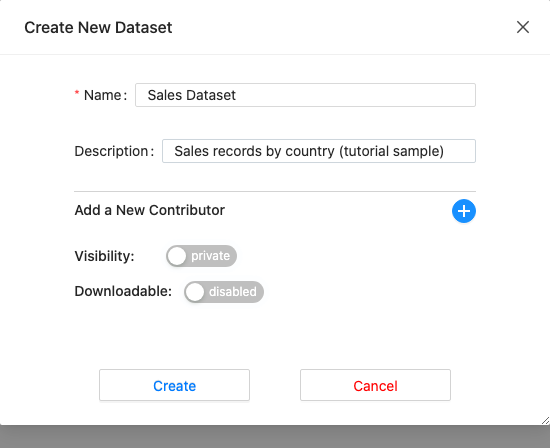
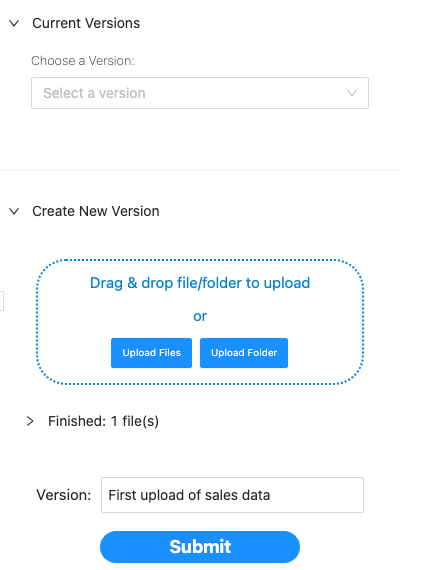
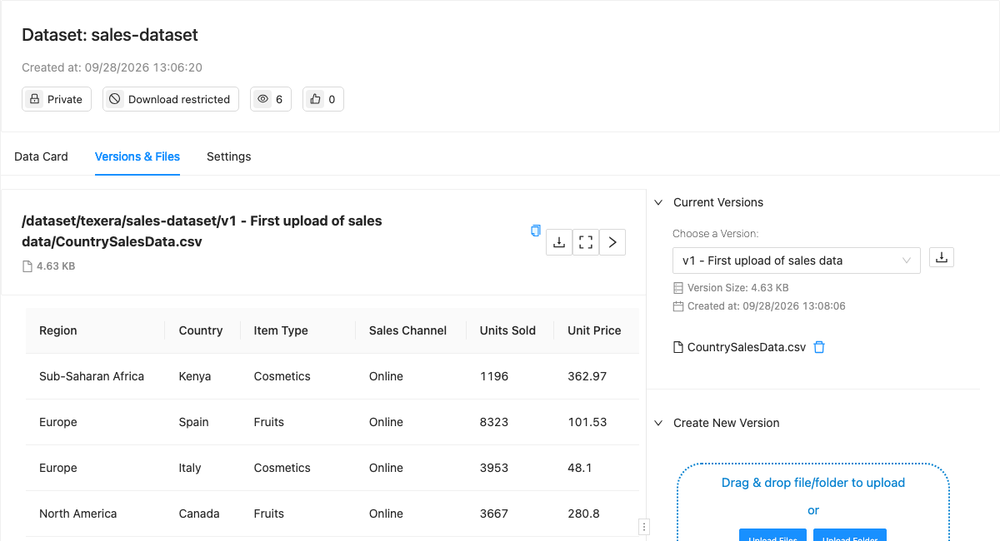
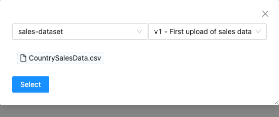
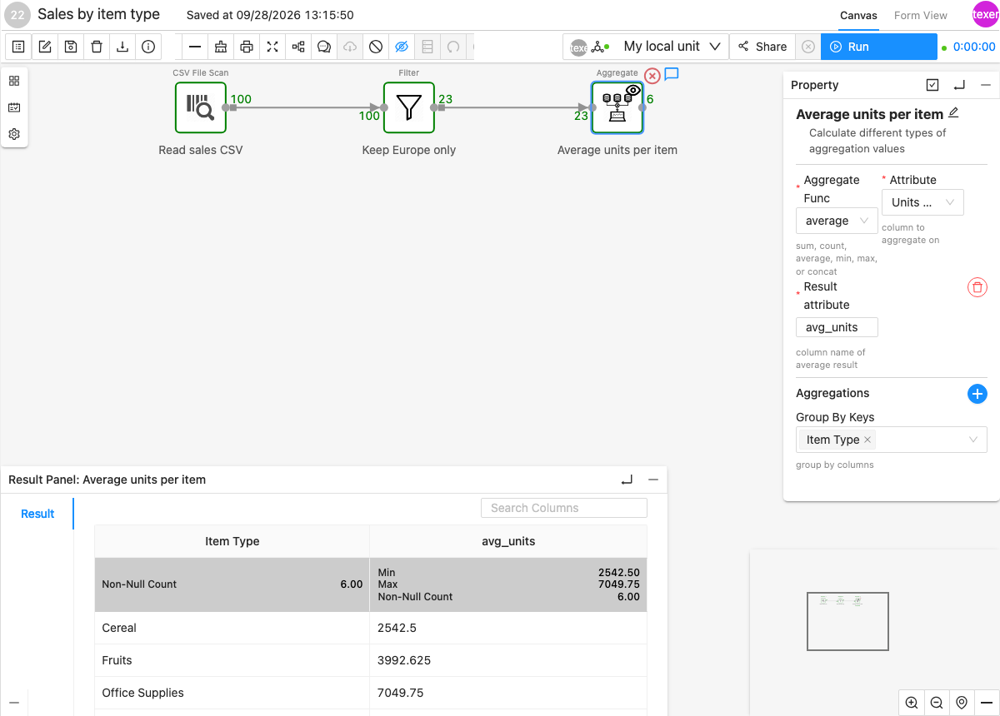

<!--
  ~ Licensed to the Apache Software Foundation (ASF) under one
  ~ or more contributor license agreements.  See the NOTICE file
  ~ distributed with this work for additional information
  ~ regarding copyright ownership.  The ASF licenses this file
  ~ to you under the Apache License, Version 2.0 (the
  ~ "License"); you may not use this file except in compliance
  ~ with the License.  You may obtain a copy of the License at
  ~
  ~   http://www.apache.org/licenses/LICENSE-2.0
  ~
  ~ Unless required by applicable law or agreed to in writing,
  ~ software distributed under the License is distributed on an
  ~ "AS IS" BASIS, WITHOUT WARRANTIES OR CONDITIONS OF ANY
  ~ KIND, either express or implied.  See the License for the
  ~ specific language governing permissions and limitations
  ~ under the License.
-->

---
title: "Create Dataset, upload data to it and use it in Workflow"
weight: 20
---

In this tutorial you upload a CSV file to Texera and build a workflow that computes the **average units sold per item type in Europe**.

Download the sample file first: [CountrySalesData.csv](CountrySalesData.csv) (100 rows of made-up sales data).

## 1. Create a dataset

A **dataset** is a folder of files stored in Texera. Every time you change its files, you save a new **version**.

1. In the left menu, go to **Your Work → Datasets** and click **Create Dataset**.
2. Enter a name, e.g. `Sales Dataset`, and click **Create**. Texera turns the name into a lowercase id (`sales-dataset`).

## 2. Upload the file and save a version

1. Open the **Versions & Files** tab.
2. Under **Create New Version**, drag the CSV onto the upload area, or click **Upload Files**.
3. Optionally describe the change (e.g. `First upload`), then click **Submit**.

The version (`v1`) now appears under **Current Versions** with a preview of the file:


A workflow reads one exact version of a file. Its path includes the version, e.g.
`/dataset/texera/sales-dataset/v1 - First upload of sales data/CountrySalesData.csv`.
When you upload a new version, existing workflows keep reading the old one. To use the new data, open the operator and select the file again, picking the new version.


## 3. Read the file in a workflow

1. Go to **Your Work → Workflows → Create Workflow**.
2. Drag a **CSV File Scan** operator (under *Data Input*) onto the canvas.
3. In its property panel, click **Select File**. Choose the dataset, the version, then the file, and click **Select**.

## 4. Filter and aggregate

1. Add a **Filter** operator and connect it after the CSV File Scan. Set: column `Region`, condition `=`, value `Europe`.
2. Add an **Aggregate** operator after the Filter. Set: function `average`, attribute `Units Sold`, result attribute `avg_units`, group by key `Item Type`.
3. Click the Aggregate box and turn on the **eye icon** in the toolbar, then click **Run**. To pick a computing unit first, see [Run a workflow](../guide-for-how-to-use-texera/#run-a-workflow).
4. Click the Aggregate box to see the result:

The numbers on the arrows show how many rows passed through: 100 read, 23 in Europe, and 6 item types.
