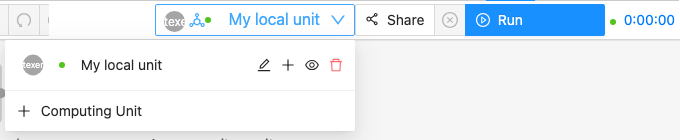
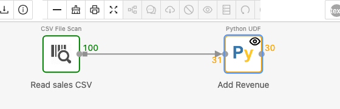
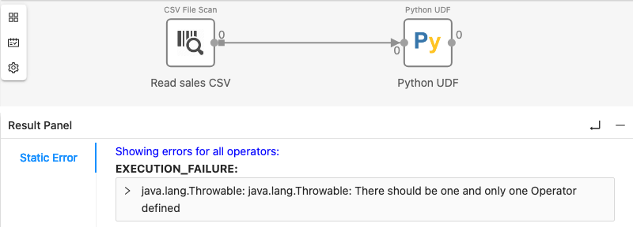
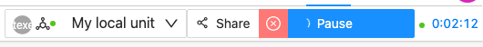

<!--
  ~ Licensed to the Apache Software Foundation (ASF) under one
  ~ or more contributor license agreements.  See the NOTICE file
  ~ distributed with this work for additional information
  ~ regarding copyright ownership.  The ASF licenses this file
  ~ to you under the Apache License, Version 2.0 (the
  ~ "License"); you may not use this file except in compliance
  ~ with the License.  You may obtain a copy of the License at
  ~
  ~   http://www.apache.org/licenses/LICENSE-2.0
  ~
  ~ Unless required by applicable law or agreed to in writing,
  ~ software distributed under the License is distributed on an
  ~ "AS IS" BASIS, WITHOUT WARRANTIES OR CONDITIONS OF ANY
  ~ KIND, either express or implied.  See the License for the
  ~ specific language governing permissions and limitations
  ~ under the License.
-->

---
title: "Guide for how to use Texera"
weight: 10
---

Texera lets you analyze data by connecting boxes (**operators**) on a canvas instead of writing a program. Each box does one step, like "read a file", "keep rows where…", or "compute an average". The arrows carry data from one box to the next.

## Sign in

Open the Texera address you were given in your browser and sign in.

On a Texera you installed yourself ([Docker guide](/docs/getting-started/installing-using-docker/)), the built-in admin account is username `texera`, password `texera`.

## The dashboard

After signing in you see the dashboard. The left menu has:

- **Hub**: workflows and datasets other people have made public.
- **Your Work**
  - **Workflows**: your workflows. Click **Create Workflow** to start one.
  - **Datasets**: your data files ([how to upload](../create-dataset-upload-data/)).
  - **Compute**: your computing units (see [below](#run-a-workflow)).
  - **Environments**: extra Python packages for Python operators.
  - **Quota**: how much storage and compute you have used.
- **Admin**: user management. Admins only.

## The workflow editor

1. **Operators**: all available boxes, grouped by type. Drag one onto the canvas, or type its name in the search box.
2. **Canvas**: connect the output dot on the right of one box to the input dot on the left of the next.
3. **Property panel**: click a box to set its options. A red outline means an option is missing or wrong.
4. **Result panel**: click a box after a run to see its output, printed messages and errors.

## Run a workflow

A **computing unit** is the machine that runs your workflow. Pick one in the top bar, then click **Run**. If the list is empty, click **+ Computing Unit** to create one.

- One computing unit can run all your workflows. Reuse it.
- Creating a new unit does **not** fix errors in a workflow. The same workflow fails the same way on every unit.
- Stopping (terminating) a unit deletes the results it holds. Your workflows and datasets are safe.

## Read a running workflow

Each box's outline color shows its state. The number on each side is how many rows went in (left) and came out (right).

| Color | Meaning |
|---|---|
| Gray | Not started yet |
| Yellow-green | Ready to start |
| Orange | Running |
| Magenta | Paused. You paused it, or a row caused an error |
| Green | Finished |

Some operators (e.g. Sort, Aggregate, and the build side of Join) must read **all** their input before they output anything. They show 0 rows out until the operator before them finishes. That's normal.

## See the results

1. Before running, click the box and turn on its **eye icon** (top toolbar). Texera shows results only for boxes with the eye on.
2. After the run, click the box. The result panel shows its rows.

The result panel only shows the box you clicked. If it says *No results available to display*, click a box that has the eye on.

## Where to find errors

- **Click an empty spot on the canvas.** The result panel then shows **Static Error**: errors from every operator, including code that failed to start.

- **Click the box** to see its **Console**: messages from `print(...)` and errors on a specific row.

Python error messages are explained in the [Python UDF guide](../guide-to-use-python-udf/#finding-and-fixing-errors).

## Pause and stop

While a workflow runs, **Run** becomes **Pause**. **Pause** can be resumed. The red ⊗ button to its left **stops** the run for good. Stop a run before fixing and re-running it.

## My workflow looks stuck

The run button says *Submitting* or *Pause*, the timer keeps counting, and every box stays at 0 rows. Check these in order:

1. **Click an empty spot on the canvas** and look at **Static Error**. Setup errors (for example in Python code) show up there.
2. **Click each colored box** and look at its **Console**. A magenta box is paused on an error.
3. **Is a box still orange, waiting for its input?** Operators such as Sort and Join wait for all their input. Check the box before it.
4. **Stop** the run (red ⊗), fix the problem, and **Run** again.
5. **Don't create a new computing unit.** The same workflow fails the same way on a new one.
6. Nothing in Static Error or the Console? Ask your Texera administrator to check the computing unit logs.
