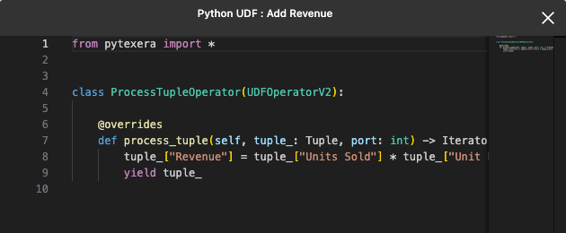
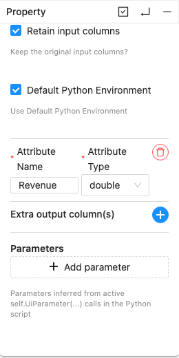
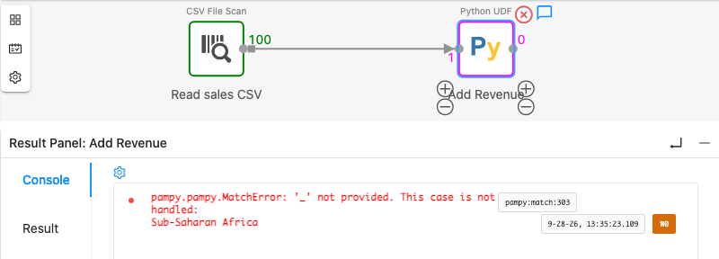

<!--
  ~ Licensed to the Apache Software Foundation (ASF) under one
  ~ or more contributor license agreements.  See the NOTICE file
  ~ distributed with this work for additional information
  ~ regarding copyright ownership.  The ASF licenses this file
  ~ to you under the Apache License, Version 2.0 (the
  ~ "License"); you may not use this file except in compliance
  ~ with the License.  You may obtain a copy of the License at
  ~
  ~   http://www.apache.org/licenses/LICENSE-2.0
  ~
  ~ Unless required by applicable law or agreed to in writing,
  ~ software distributed under the License is distributed on an
  ~ "AS IS" BASIS, WITHOUT WARRANTIES OR CONDITIONS OF ANY
  ~ KIND, either express or implied.  See the License for the
  ~ specific language governing permissions and limitations
  ~ under the License.
-->

---
title: "Guide to Use a Python UDF"
weight: 30
---

A **Python UDF** (user-defined function) is an operator that runs a small piece of Python code you write. Use it when no built-in operator does what you need.

You don't need to be a programmer. Copy the example below and change one line at a time.

## Which Python operator should I use?

| You want to… | Use |
|---|---|
| Add or change a column with a one-line formula, e.g. `tuple_["Units Sold"] * 2` | **Python Lambda Function** (no class to write) |
| Turn a whole table into one summary row, e.g. `table["Units Sold"].mean()` | **Python Table Reducer** (no class to write) |
| Anything else with one or more inputs | **Python UDF** |
| Apply a model (input 0) to data rows (input 1) | **2-in Python UDF** |
| Create data from nothing (no input) | **1-out Python UDF** |

## Your first UDF in 4 steps

This example adds a `Revenue` column (units × price) to the sales data from [the dataset tutorial](../create-dataset-upload-data/).

**1. Add the operator.** Drag **Python UDF** (under *User-defined Functions*) onto the canvas and connect your data to it.

**2. Write the code.** Click **Edit code content**. The editor opens with a template in which **every line is commented out** (starts with `#`). Running it as-is fails. Replace it with:

```python
from pytexera import *


class ProcessTupleOperator(UDFOperatorV2):

    @overrides
    def process_tuple(self, tuple_: Tuple, port: int) -> Iterator[Optional[TupleLike]]:
        tuple_["Revenue"] = tuple_["Units Sold"] * tuple_["Unit Price"]
        yield tuple_
```



**3. Declare the new column.** In the property panel, under **Extra output column(s)**, click **+** and add `Revenue` with type `double`. Leave **Retain input columns** checked to keep the original columns.



**4. Run.** Click the eye icon on the UDF, then **Run**. Click the UDF to see its result.

## The 5 rules

Almost every UDF problem comes from breaking one of these.

| # | Rule | If you break it |
|---|---|---|
| 1 | The first line is `from pytexera import *` | `name 'UDFOperatorV2' is not defined` |
| 2 | Exactly **one** class. Delete or comment out the others. | `There should be one and only one Operator defined` |
| 3 | The method name must match the class you inherit from (table below) | `... No super class method found`, or rule 2's error |
| 4 | Send results with `yield`, never `return` | Confusing errors such as `MatchError` or `'NoneType' object is not iterable` |
| 5 | The columns you yield must match the output columns (step 3) | `expected but missing` or `unexpected field` |

## How your code receives data

Pick one row of this table. The class name in brackets and the method name must go together.

| Class `(…)` | Method you write | You receive | Good for |
|---|---|---|---|
| `UDFOperatorV2` | `process_tuple(self, tuple_, port)` | one row at a time (use it like a dict: `tuple_["col"]`) | per-row formulas, filtering |
| `UDFBatchOperator` | `process_batch(self, batch, port)` | `BATCH_SIZE` rows at a time, as a pandas DataFrame | calling an API in chunks |
| `UDFTableOperator` | `process_table(self, table, port)` | **all** rows of one input, as a pandas DataFrame | sorting, statistics, ML training |
| `UDFSourceOperator` (1-out UDF only) | `produce(self)` | nothing; you create the data | generating or downloading data |

What you can `yield`:

- **A row**: a `Tuple` or a `dict`, e.g. `yield {"name": "a", "value": 1}`.
- **A table**: a pandas `DataFrame` or `Table`. Yield the DataFrame itself, not a dict that contains DataFrames.
- **`None`**: produce nothing for this input.

To drop a row, just don't `yield` it. To output several rows, `yield` several times.

## One-time setup (loading a model, opening a file)

Put setup code in `open()`, which runs once before any data arrives:

```python
from pytexera import *


class ProcessTupleOperator(UDFOperatorV2):

    @overrides
    def open(self):
        self.threshold = 100

    @overrides
    def process_tuple(self, tuple_: Tuple, port: int) -> Iterator[Optional[TupleLike]]:
        if tuple_["Units Sold"] > self.threshold:
            yield tuple_
```

If you write `__init__` instead, its first line must be `super().__init__()`. Otherwise `UDFTableOperator` fails with `'_TableOperator__table_data'`.

To set values like `threshold` from the property panel instead of in code, see [UI parameters](/docs/reference/operators/user-defined-functions/python/#ui-parameters).

## Output columns

The UDF's output columns are **Retain input columns** (the input's columns, if checked) plus **Extra output column(s)**. Every row you `yield` must contain exactly these columns.

- Adding a column? Add it under **Extra output column(s)**.
- Returning a completely new table (e.g. a summary)? Uncheck **Retain input columns** and list every output column.
- With several inputs, **Retain input columns** keeps the columns of input 0 (for the 2-in UDF: the `tuples` input, port 1).

## Several inputs

Add input ports with the **+** under the operator's left side. Ports are numbered from 0. Your method's `port` argument tells you which input a row came from.

- **Inputs arrive in no fixed order.** Don't assume input 0 finishes before input 1.
- To combine inputs safely, use `UDFTableOperator`. It calls `process_table` once per input, when that input is complete. Keep each table and act when you have all of them:

```python
from pytexera import *

NUM_INPUTS = 2


class ProcessTableOperator(UDFTableOperator):

    @overrides
    def open(self):
        self.tables = {}

    @overrides
    def process_table(self, table: Table, port: int) -> Iterator[Optional[TableLike]]:
        self.tables[port] = table
        if len(self.tables) == NUM_INPUTS:
            yield self.tables[0].merge(self.tables[1], on="Country")
```

- To force an order, click an input port's dot. Under **dependencies**, list the ports that must finish first. For example, port 1 with dependencies `0` waits for port 0.
- The **2-in Python UDF** has this built in: port 0 (`model`) is read completely before port 1 (`tuples`) starts.

```python
from pytexera import *


class ProcessTupleOperator(UDFOperatorV2):

    @overrides
    def process_tuple(self, tuple_: Tuple, port: int) -> Iterator[Optional[TupleLike]]:
        if port == 0:  # model input: remember the model
            self.model = tuple_["model"]
        else:  # tuples input: use it
            tuple_["pred"] = self.model.predict([tuple_["text"]])[0]
            yield tuple_
```

## Creating data (1-out Python UDF)

```python
from pytexera import *


class GenerateOperator(UDFSourceOperator):

    @overrides
    def produce(self) -> Iterator[Union[TupleLike, TableLike, None]]:
        for i in range(10):
            yield {"number": i}
```

List every column (here `number`, type `integer`) under **Columns** in the property panel. More examples: [pytexera examples](https://github.com/apache/texera/tree/main/amber/src/main/python/pytexera/udf/examples).

## Finding and fixing errors

- `print(...)` in your code shows up in the **Console** tab. Click the UDF to see it.
- If a row fails, the UDF turns **magenta** (paused) and the error appears in its **Console**. Fix the code, then stop the run (red ⊗ next to *Pause*) and run again.



- If the code can't even load (missing import, wrong class), the error appears in **Static Error**. Click an empty spot on the canvas to see it. See [where to find errors](../guide-for-how-to-use-texera/#where-to-find-errors).

| Error message contains | Cause | Fix |
|---|---|---|
| `name 'UDFOperatorV2' is not defined` (or `Tuple`, `Table`, …) | Missing import | Add `from pytexera import *` as the first line |
| `There should be one and only one Operator defined` | No class, or more than one (e.g. the template is still all comments) | Keep exactly one class, uncommented |
| `No super class method found` | Method doesn't match the class (e.g. `process_table` in a `UDFOperatorV2`) | Use the pair from [the table](#how-your-code-receives-data) |
| `MatchError: '_' not provided` or `'NoneType' object is not iterable` | `return` used instead of `yield` | Replace `return x` with `yield x` |
| `_TableOperator__table_data` | `__init__` without `super().__init__()` | Add `super().__init__()`, or use `open()` |
| `expected but missing in the Tuple` | A declared output column is missing from what you yield | Yield that column, or remove it from **Extra output column(s)** |
| `contains unexpected field` | You yield a column that isn't declared | Add it under **Extra output column(s)**, or stop yielding it |
| `Column name X already exists!` | An extra output column has the same name as an input column | Rename it, or uncheck **Retain input columns** |
| Workflow stays at 0 rows and nothing happens | Code failed while starting | See [My workflow looks stuck](../guide-for-how-to-use-texera/#my-workflow-looks-stuck) |
