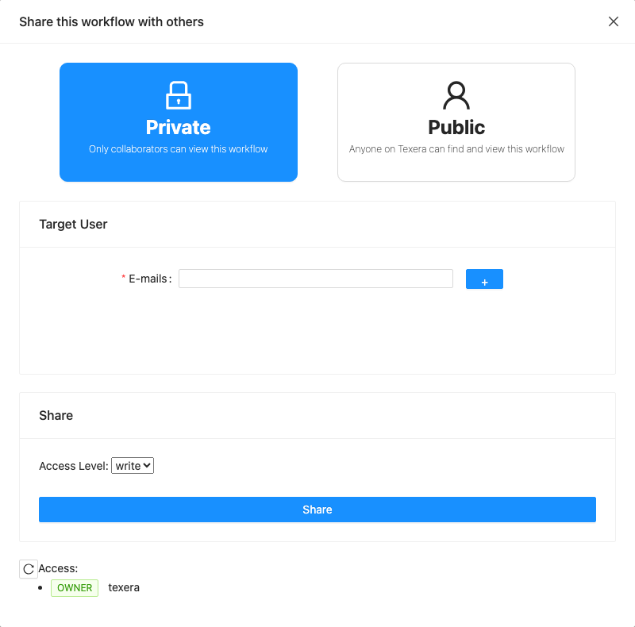

<!--
  ~ Licensed to the Apache Software Foundation (ASF) under one
  ~ or more contributor license agreements.  See the NOTICE file
  ~ distributed with this work for additional information
  ~ regarding copyright ownership.  The ASF licenses this file
  ~ to you under the Apache License, Version 2.0 (the
  ~ "License"); you may not use this file except in compliance
  ~ with the License.  You may obtain a copy of the License at
  ~
  ~   http://www.apache.org/licenses/LICENSE-2.0
  ~
  ~ Unless required by applicable law or agreed to in writing,
  ~ software distributed under the License is distributed on an
  ~ "AS IS" BASIS, WITHOUT WARRANTIES OR CONDITIONS OF ANY
  ~ KIND, either express or implied.  See the License for the
  ~ specific language governing permissions and limitations
  ~ under the License.
-->

---
title: "Sharing and Permissions"
weight: 25
---

You can share **workflows**, **datasets** and, if your admin enabled it, **computing units**.

## Share with a person

1. Open the item and click **Share**: in the workflow editor's top bar, or the share icon on the item in your dashboard list.
2. Type the person's e-mail (they need a Texera account) and click **+**. You can add several.
3. Pick an **Access Level** and click **Share**.

The **Access** list at the bottom shows who has access. Change someone's level there, or remove them with the trash icon.

## Access levels

| Level | Can do |
|---|---|
| **read** | Open and view. The workflow canvas is read-only. |
| **write** | Also edit, share with others, and make it public |
| **OWNER** | Everything. The creator. Can't be removed. |

To **run** a workflow you need **write** access to a computing unit, even if you can open the workflow.

## Datasets are shared separately

Sharing a workflow does **not** share the datasets it reads. When someone else runs your workflow, Texera checks *their* access to each dataset. Share the datasets with them too, or make them public.

## Public items

- **Public** in the share dialog lets anyone on Texera find and view the item on the **Hub**. Anyone signed in can **Clone** a public workflow to get their own editable copy.
- For datasets, the dataset's **Settings** tab also has **Downloadable**. When it's off, other people can browse the files but can't download them.
